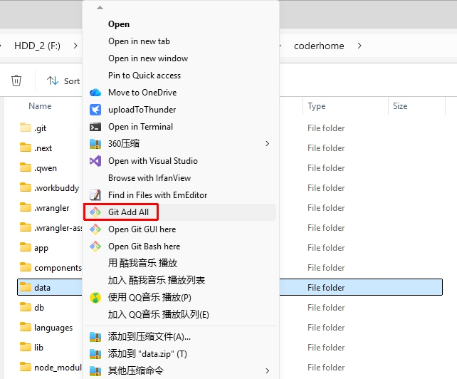

# GIT-ADD-FOLDER

[ENGLISH](README.md) | [中文](README.cn.md)

Add all changes in a Git repository with one click from the Windows File Explorer context menu.

After installing `git-add.reg`, a new **Git Add All** item is added to the context menu. When you use it, a console window opens, changes to the folder you selected, and runs:

```text
git add .
```

This is useful when you want to stage many files at once instead of adding files individually. You can still leave out files you do not want to stage by using Git's normal ignore and staging workflows.

## Requirements

- Windows only
- Git for Windows must already be installed
- The selected folder should be a Git repository, or be inside one

## Installation

1. Download or clone this repository.
2. Double-click `git-add.reg`.
3. Confirm the Windows Registry Editor prompts.
4. Restart File Explorer if **Git Add All** does not appear immediately.

The registry file uses the default Git for Windows icon location. If Git is installed in a different location, the menu item still works, but its icon may not appear.

## How to use

1. Open File Explorer and locate your Git repository.
2. Use either of these methods:
	- Right-click the repository folder and select **Git Add All**.
	- Open the repository folder, right-click empty space inside it, and select **Git Add All**.



3. A console window runs `git add .` in that folder.
4. Check the staged files with `git status`, then commit when ready.

The command stages files below the selected folder. It does not create a commit or push anything to a remote repository.

## Uninstall

The easiest way to remove the context-menu entries is to double-click `git-add-uninstall.reg` and confirm the Windows Registry Editor prompts. Restart File Explorer if **Git Add All** remains visible.

Alternatively, open Registry Editor and delete these keys manually:

```text
HKEY_CLASSES_ROOT\Directory\Background\shell\GitAdd
HKEY_CLASSES_ROOT\Directory\shell\GitAdd
```

Only remove these keys if you want to uninstall this tool.
